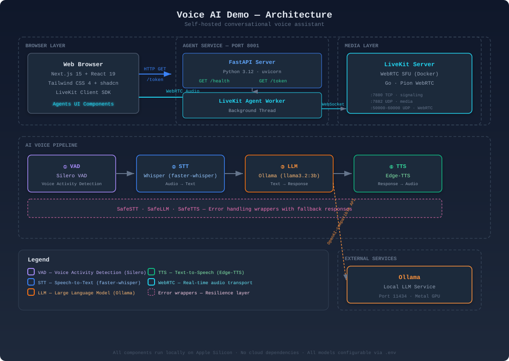

# Voice AI Demo

> Fully self-hosted, open-source conversational voice AI assistant powered by LiveKit Agents.

    

## Features

- **Real-time voice conversation** with low-latency WebRTC audio transport via LiveKit
- **100% self-hosted** — all AI models run locally, no cloud dependencies, no API keys required
- **Configurable AI pipeline** — swap STT, LLM, and TTS providers at runtime via `.env`
- **Apple Silicon optimized** — Metal GPU acceleration for Whisper, Llama, and other models
- **Polished web UI** — Next.js 15 + LiveKit Agents UI with audio visualizer, chat transcript, and mic controls
- **Docker-based LiveKit** — one command to start the WebRTC signalling/media server
- **Error resilient** — SafeSTT/SafeLLM/SafeTTS wrappers handle failures gracefully with fallback responses
- **Test mode** — `--test-mode` flag uses stubs for CI testing without real models

## Architecture

<picture>
  <source media="(prefers-color-scheme: dark)" srcset="architecture.svg">
  
</picture>

### Data Flow

1. User opens `http://localhost:3000` in browser
2. Frontend calls `GET /token` on FastAPI server → receives signed LiveKit JWT
3. Browser connects to LiveKit Server via WebRTC using the JWT
4. LiveKit dispatches a job to the Agent Worker (background thread)
5. Agent processes audio through the voice pipeline:
   - **Silero VAD** — detects speech segments and utterance boundaries
   - **Whisper STT** — transcribes audio to text using local faster-whisper model
   - **Ollama LLM** — generates natural language response via OpenAI-compatible API
   - **Edge-TTS** — synthesizes response audio using Microsoft Edge TTS engine
6. Response audio streams back through LiveKit → browser plays it in real-time
7. Conversation transcript updates in the Agents UI chat component

### Component Breakdown

| Component | Technology | Role |
|---|---|---|
| **Frontend** | Next.js 15, React 19, Tailwind CSS 4, Agents UI | Voice interface with mic controls, audio visualization, conversation transcript |
| **Agent Server** | Python 3.12, FastAPI, LiveKit Agents SDK 1.5 | JWT token generation, health check, voice pipeline orchestration |
| **LiveKit Server** | Go, WebRTC SFU (Docker) | Media routing, room management, job dispatch to agent workers |
| **Ollama** | Go, Metal GPU (Apple Silicon) | Local LLM inference serving OpenAI-compatible API |
| **Agent Pipeline** | LiveKit PipelineAgent | Sequential processing: VAD → STT → LLM → TTS |

## Prerequisites

- **Docker** — for running LiveKit Server
- **Python 3.12+** — for the agent service
- **Node.js 22+** — for the frontend
- **Ollama** — for local LLM inference
- **Apple Silicon Mac** (recommended) — Metal GPU acceleration; Intel Mac or Linux also works with CPU

## Quick Start

### 1. Start LiveKit Server

```bash
cp .env.example .env
docker compose up -d
```

Verify: `curl http://localhost:7880` should return LiveKit response.

### 2. Start Ollama

```bash
ollama serve
ollama pull llama3.2:3b   # or qwen2.5:7b, mistral, phi-4, etc.
```

Verify: `curl http://localhost:11434/api/tags` should list models.

### 3. Start Agent Service

```bash
cd agent
python -m venv .venv && source .venv/bin/activate
pip install -r requirements.txt
python main.py
```

Verify: `curl http://localhost:8001/health` should return `{"status":"ok"}`.

### 4. Start Frontend

```bash
cd frontend
npm install
npm run dev
```

Open **http://localhost:3000** in your browser.

## Configuration

All settings are configured via `.env` file. Copy `.env.example` to `.env` and customize:

### LiveKit Configuration

| Variable | Default | Description |
|---|---|---|
| `LIVEKIT_URL` | `ws://localhost:7880` | WebSocket URL of LiveKit server |
| `LIVEKIT_API_KEY` | `devkey` | LiveKit API key for authentication |
| `LIVEKIT_API_SECRET` | `secret` | LiveKit API secret for JWT signing |

### Speech-to-Text (STT)

| Variable | Default | Description |
|---|---|---|
| `STT_PROVIDER` | `whisper` | `whisper` (local faster-whisper) or `openai_compatible` |
| `STT_MODEL` | `large-v3-turbo` | Whisper model size: `tiny`, `base`, `small`, `medium`, `large-v3-turbo` |
| `STT_BASE_URL` | _(empty)_ | Required if `STT_PROVIDER=openai_compatible` |

### LLM

| Variable | Default | Description |
|---|---|---|
| `LLM_PROVIDER` | `ollama` | `ollama` or `openai_compatible` |
| `LLM_MODEL` | `llama3.2:3b` | Model name as recognized by the provider |
| `LLM_BASE_URL` | `http://localhost:11434/v1` | OpenAI-compatible API endpoint |

### Text-to-Speech (TTS)

| Variable | Default | Description |
|---|---|---|
| `TTS_PROVIDER` | `edge-tts` | `edge-tts` (local) or `openai_compatible` |
| `TTS_MODEL` | `en-US-AriaNeural` | Voice/model identifier |
| `TTS_BASE_URL` | _(empty)_ | Required if `TTS_PROVIDER=openai_compatible` |

### Frontend

| Variable | Default | Description |
|---|---|---|
| `NEXT_PUBLIC_TOKEN_SERVER` | `http://localhost:8001` | FastAPI token endpoint URL |
| `NEXT_PUBLIC_LIVEKIT_URL` | `ws://localhost:7880` | LiveKit server URL for browser connection |

### Model Switching Examples

**Switch to Groq (cloud LLM, free tier):**
```env
LLM_PROVIDER=openai_compatible
LLM_MODEL=llama-3.3-70b-versatile
LLM_BASE_URL=https://api.groq.com/openai/v1
```
And add `GROQ_API_KEY=your_key` to `.env`.

**Switch to OpenAI Whisper API (cloud STT):**
```env
STT_PROVIDER=openai_compatible
STT_MODEL=whisper-1
STT_BASE_URL=https://api.openai.com/v1
```
And add `OPENAI_API_KEY=your_key` to `.env`.

**Switch to Cartesia TTS (cloud TTS):**
```env
TTS_PROVIDER=openai_compatible
TTS_MODEL=sonic-2
TTS_BASE_URL=https://api.cartesia.ai/v1
```
And add `CARTESIA_API_KEY=your_key` to `.env`.

## Project Structure

```
voiceai/
├── agent/                          # Python backend service
│   ├── main.py                     # FastAPI server entrypoint
│   ├── agent.py                    # LiveKit agent with Safe wrappers
│   ├── config.py                   # Pydantic settings from .env
│   ├── stt.py                      # STT factory (Whisper local / OpenAI-compatible)
│   ├── llm.py                      # LLM factory (Ollama / OpenAI-compatible)
│   ├── tts.py                      # TTS factory (Edge-TTS / OpenAI-compatible)
│   ├── requirements.txt            # Python dependencies
│   ├── Dockerfile                  # Container build
│   └── tests/                      # 15 tests
│       ├── test_config.py
│       ├── test_stt.py
│       ├── test_llm.py
│       ├── test_tts.py
│       └── test_main.py
│
├── frontend/                       # Next.js web application
│   ├── app/
│   │   ├── page.tsx                # Main voice interface
│   │   ├── layout.tsx              # Root layout
│   │   └── globals.css             # Tailwind + LiveKit styles
│   ├── components/
│   │   └── agents-ui/              # Installed Agents UI components
│   ├── lib/
│   │   └── token.ts                # Token fetch from FastAPI
│   └── __tests__/                  # Frontend tests
│       ├── token.test.ts
│       └── page.render.test.tsx
│
├── tests/                          # Shared test fixtures
│   ├── agent/
│   │   └── test_pipeline.py        # Pipeline integration test
│   ├── e2e/
│   │   └── test_roundtrip.py       # End-to-end health + token test
│   └── fixtures/
│       ├── stubs.py                # FakeSTT/FakeLLM/FakeTTS for test mode
│       ├── test-config.env
│       └── sample-speech.wav       # Audio fixture
│
├── docker-compose.yml              # LiveKit server
├── livekit.yaml                    # LiveKit configuration
├── .env.example                    # Environment variable template
├── .gitignore
└── README.md
```

## Testing

```bash
# Agent unit & integration tests (15 tests)
cd agent && python -m pytest tests/ -v

# Pipeline & E2E tests (requires LiveKit running)
cd agent && PYTHONPATH=. python -m pytest ../tests/ -v

# Frontend tests (4 tests)
cd frontend && npm test

# Run in test mode (uses stubs, no models required)
cd agent && python main.py --test-mode
```

## Troubleshooting

| Problem | Likely Cause | Solution |
|---|---|---|
| Browser audio not working | Autoplay policy | Click **Start audio** button in UI |
| LiveKit connection refused | Docker not running | `docker compose up -d` |
| Agent won't start | Missing `.env` | `cp .env.example .env` |
| Ollama model not found | Model not pulled | `ollama pull llama3.2:3b` |
| Frontend blank page | Missing npm install | `cd frontend && npm install` |
| STT slow on first run | Whisper model downloading | First run downloads model (~3GB), subsequent runs are instant |
| `livekit-api` import error | Wrong package version | `pip install livekit-api` (replaces deprecated `livekit-server-sdk`) |
| WebRTC connection drops | Firewall blocking UDP | Ensure ports 7882, 50000-60000 UDP are open |

## Tech Stack

| Category | Technology |
|---|---|
| **Framework** | LiveKit Agents SDK 1.5 |
| **Server** | Python 3.12, FastAPI, uvicorn |
| **Frontend** | Next.js 15, React 19, Tailwind CSS 4, Agents UI (shadcn) |
| **STT** | faster-whisper (local), OpenAI-compatible API |
| **LLM** | Ollama (local), OpenAI-compatible API |
| **TTS** | Edge-TTS (local), OpenAI-compatible API |
| **Media** | WebRTC via LiveKit SFU (Docker) |
| **Testing** | pytest, vitest, httpx, Testing Library |
